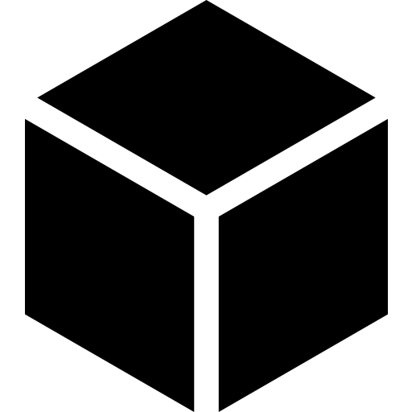
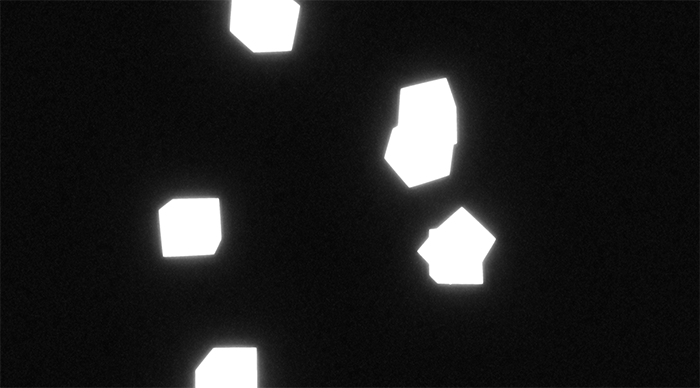

<!--
*** Thanks for checking out the Best-README-Template. If you have a suggestion
*** that would make this better, please fork the repo and create a pull request
*** or simply open an issue with the tag "enhancement".
*** Thanks again! Now go create something AMAZING! :D
-->


<!-- PROJECT SHIELDS -->
<!--
*** I'm using markdown "reference style" links for readability.
*** Reference links are enclosed in brackets [ ] instead of parentheses ( ).
*** See the bottom of this document for the declaration of the reference variables
*** for contributors-url, forks-url, etc. This is an optional, concise syntax you may use.
*** https://www.markdownguide.org/basic-syntax/#reference-style-links
-->


[![LinkedIn][linkedin-shield]][linkedin-url]
<!-- PROJECT LOGO -->
<br />
<p align="center">
  <a href="https://github.com/bmangeat/cube-follow-path">
    
  </a>

<h3 align="center">Lost Cubes</h3>

  <p align="center">
    <a href="https://bmangeat.github.io/cube-follow-path/">View Demo</a>
    ·
    <a href="https://github.com/bmangeat/cube-follow-path/issues">Report Bug</a>
    ·
    <a href="https://github.com/bmangeat/cube-follow-path/issues">Request Feature</a>
  </p>


<!-- TABLE OF CONTENTS -->
<details open="open">
  <summary>Table of Contents</summary>
  <ol>
    <li>
      <a href="#about-the-project">About The Project</a>
      <ul>
        <li><a href="#built-with">Built With</a></li>
      </ul>
    </li>
    <li>
      <a href="#getting-started">Getting Started</a>
      <ul>
        <li><a href="#prerequisites">Prerequisites</a></li>
        <li><a href="#installation">Installation</a></li>
      </ul>
    </li>
    <li><a href="#contributing">Contributing</a></li>
    <li><a href="#license">License</a></li>
    <li><a href="#contact">Contact</a></li>
  </ol>
</details>


<!-- ABOUT THE PROJECT -->
## About The Project

<p>
    
</p>

Cubes follow a random path generated by a custom function

### Built With

Major frameworks I used in this project.
* [ThreeJS](https://threejs.org/)
* [GSAP](https://greensock.com/gsap/)
* [Parcel](https://parceljs.org/)


<!-- GETTING STARTED -->
## Getting Started


### Prerequisites

You need to npm to run this project. Just a detail because everyone already has it.
* npm
  ```sh
  npm install npm@latest -g
  ```

### Installation

1. Clone the repo
   ```sh
   git clone https://github.com/bmangeat/cube-follow-path.git
   ```
3. Install NPM packages
   ```sh
   npm install
   ```


<!-- CONTRIBUTING -->
## Contributing

Contributions are what make the open source community such an amazing place to be learn, inspire, and create. Any contributions you make are **greatly appreciated**.

1. Fork the Project
2. Create your Feature Branch (`git checkout -b feature/AmazingFeature`)
3. Commit your Changes (`git commit -m 'Add some AmazingFeature'`)
4. Push to the Branch (`git push origin feature/AmazingFeature`)
5. Open a Pull Request


<!-- LICENSE -->
## License

Distributed under the ISC License.


<!-- CONTACT -->
## Contact

Your Name - [@BriceMangeat](https://twitter.com/BriceMangeat) - brice.mangeat@gmail.com

Project Link: [https://github.com/bmangeat/cube-follow-path](https://github.com/bmangeat/cube-follow-path)


<!-- MARKDOWN LINKS & IMAGES -->
<!-- https://www.markdownguide.org/basic-syntax/#reference-style-links -->

[linkedin-shield]: https://img.shields.io/badge/-LinkedIn-black.svg?style=for-the-badge&logo=linkedin&colorB=555
[linkedin-url]: https://www.linkedin.com/in/brice-mangeat-web-student/
